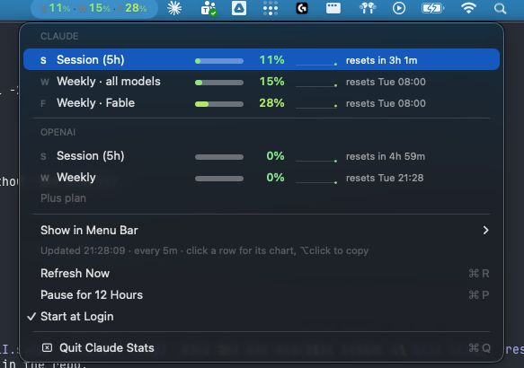

# Claude Stats

A macOS menu bar app that keeps your Claude usage percentages visible at all times —
the same numbers `/usage` shows inside Claude Code. If the machine also has a Codex
login, your OpenAI quotas ride along.

<p align="center">
  
</p>

## Features

- Session and weekly percentages in the menu bar, coloured on a continuous
  green → red scale; a spent quota shows its reset countdown instead of a useless `100%`
- Dropdown with meters, trend sparklines, reset countdowns, and a full chart
  (with burn rate and projected run-out) on click
- OpenAI/Codex quotas alongside Claude when `~/.codex/auth.json` exists
- **Show in Menu Bar** picks which quotas occupy the bar (default: Claude only)
- Adaptive polling: 5–10 min while numbers move, nothing while the screen is
  off, an immediate fetch when you come back, on-demand fetch when the menu opens
- Read-only credentials: borrows the tokens Claude Code and the Codex CLI already
  maintain, never touches a refresh token, never prompts for keychain access
- Survives offline: last reading is cached and fades with age instead of vanishing

## Installation

Download the latest `Claude-Stats.zip` from the
[Releases page](https://github.com/elva-labs/claude-stats/releases/latest), unzip,
and drag `Claude Stats.app` into `/Applications`.

Sign in to Claude Code (`claude`) at least once — the app reads its usage numbers
through the CLI's login. Codex (`codex login`) is optional and auto-detected.

### Build from source

Requires macOS 14+ and the Swift toolchain that ships with Xcode.

```sh
git clone https://github.com/elva-labs/claude-stats.git
cd claude-stats
./build.sh
```

`build.sh` compiles, wraps the binary into `Claude Stats.app`, installs it to
`/Applications`, and launches it. Re-running it replaces a running copy.

## How it works

Claude Code stores an OAuth token in the login keychain; the Codex CLI stores one in
`~/.codex/auth.json`. Claude Stats reads those tokens — read-only, re-read on every
poll — and calls the same usage endpoints the CLIs' own status commands use. When a
token goes stale the app nudges the owning CLI to renew it and re-reads the result;
it never redeems a refresh token itself, because refresh tokens rotate and a second
owner would break your actual login.

The full reasoning — colour scale, trend lines, polling cadence, throttle handling,
file formats — lives in [docs/DESIGN.md](docs/DESIGN.md).

## License

[MIT](LICENSE)
